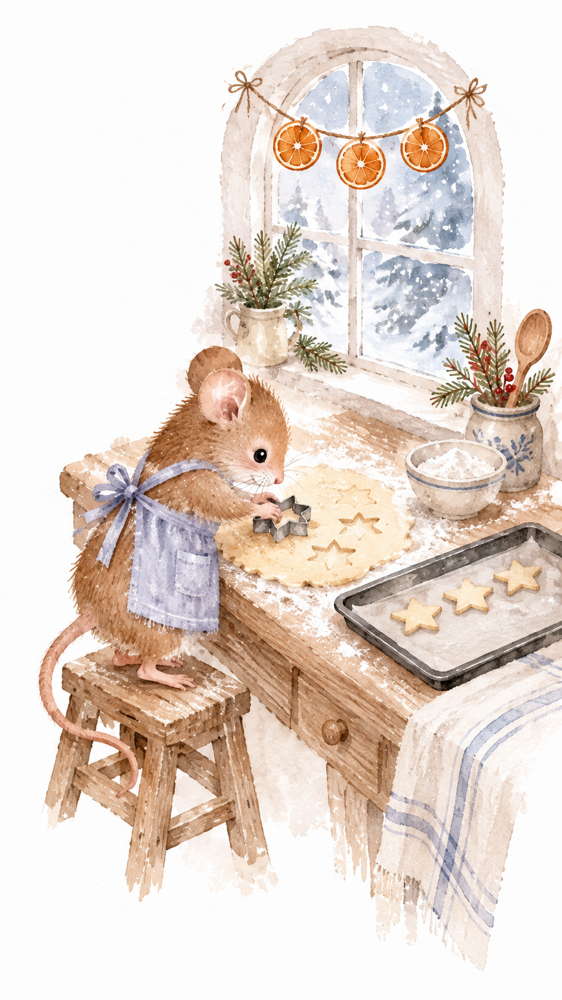
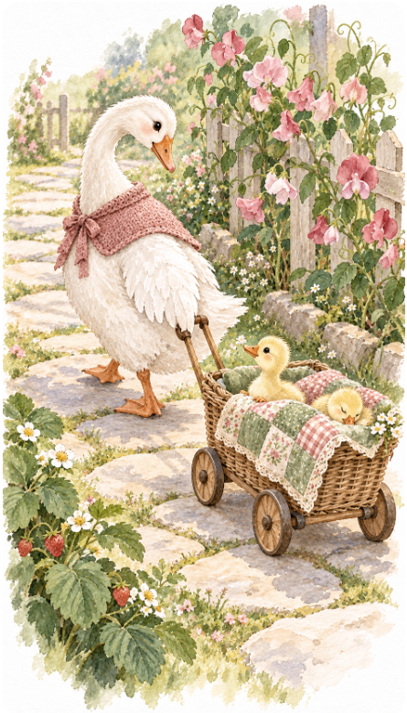
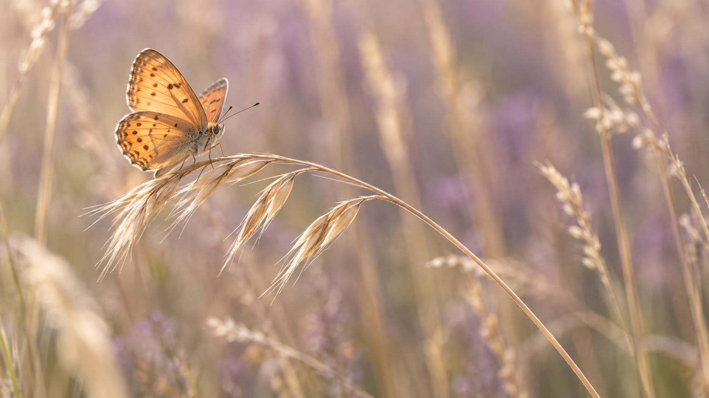
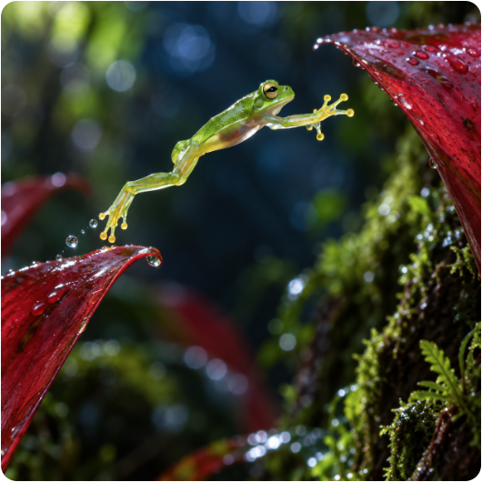
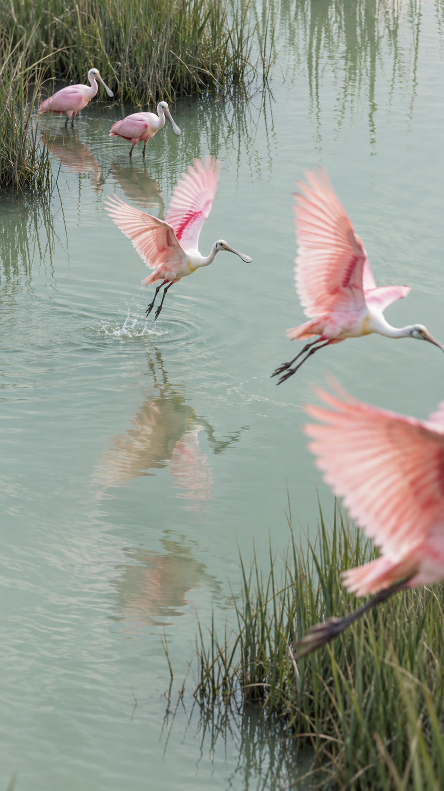
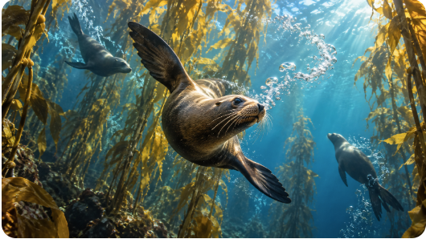
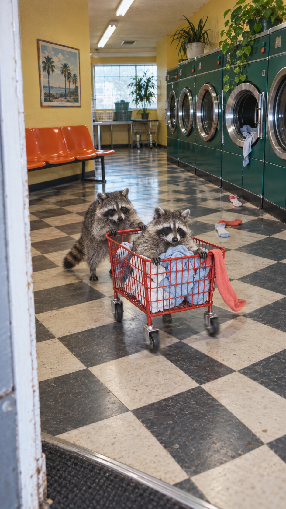
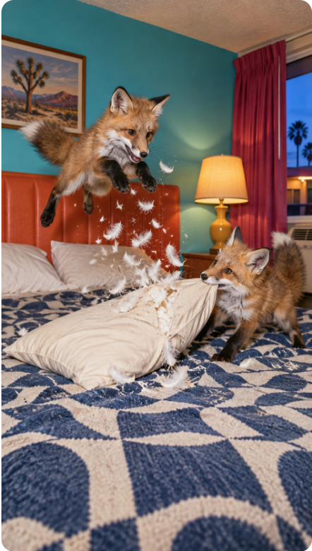

# Example Gallery

These examples pair the original high-resolution reference images with generated results from real uses of the skill.

## 1. Storybook watercolor

**Reference direction:** a gentle domestic watercolor scene with warm detail and a nostalgic illustrated-book feeling.

| Reference | Reimagined result |
| --- | --- |
|  |  |

The result carries forward the soft watercolor treatment and storybook warmth while changing the characters, action, and setting into a garden journey.

## 2. Macro nature photography

**Reference direction:** shallow-focus nature photography with a quiet, delicate moment and luminous natural color.

| Reference | Reimagined result |
| --- | --- |
|  |  |

The result preserves the macro scale, shallow depth of field, and fleeting natural moment, then rebuilds the subject, action, and color contrast around a frog's leap.

## 3. Group motion in nature

**Reference direction:** a group of birds moving through a pale natural scene, with layered depth and a decisive instant.

| Reference | Reimagined result |
| --- | --- |
|  |  |

The result translates group motion and spatial layering into an underwater environment, using cool blue water, golden kelp, and directional light.

## 4. Playful animal action

**Reference direction:** a candid, humorous animal scene with energetic interaction and strong color.

| Reference | Reimagined result |
| --- | --- |
|  |  |

The result retains the comic physical energy and snapshot immediacy while changing the animals, action, interior, and visual story.
